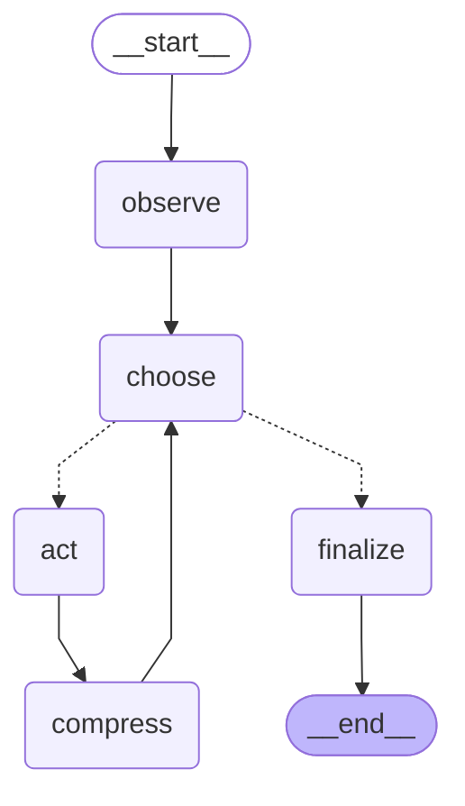

# Raschka_Coding_Agent_LangGraph

[](https://github.com/BrendanJamesLynskey/Raschka_Coding_Agent_LangGraph/actions/workflows/ci.yml)

A LangGraph implementation of the coding-agent architecture described in
Sebastian Raschka's article
[**Components of a Coding Agent**](https://magazine.sebastianraschka.com/p/components-of-a-coding-agent).

The goal is **learnability**, not production polish: every component from the
article maps onto a single, heavily-commented module so you can read the code
top-to-bottom and watch the ideas turn into Python.

* Supports **Google Gemini**, **DeepSeek**, **OpenAI**, local
  open-weights models via **Ollama** (Qwen by default), and a built-in
  scripted **fake** provider for tests.
* Every LLM call is captured in full — pretty stdout panels via `rich` plus
  one-record-per-line JSONL on disk.
* Sandboxed file + shell tools rooted at a workspace directory; paths that
  try to escape are rejected before the tool runs.
* All six of the article's components, including bounded subagents.
* 68 offline tests, **zero** of which hit a real provider.

## Highlights

What this repo shows, if you are here for the LangGraph / LangChain side:

* **A hand-built LangGraph state machine.** `StateGraph` over a
  `TypedDict` state, a conditional edge for tool routing, an iteration
  guard, and a compression node. There is no prebuilt agent: the whole
  loop is under 400 readable lines. The diagram below is generated from
  the compiled graph, and a test fails if it drifts.
* **Provider-agnostic models.** One `build_chat_model` seam over
  `ChatGoogleGenerativeAI`, `ChatOpenAI` (OpenAI and DeepSeek) and
  `ChatOllama`, which runs **local open-weights Qwen** with no API key.
  Provider imports are lazy, and the local provider ships as an extra.
* **Bounded subagents (Component 6).** A `spawn_subagent` tool re-enters
  the *same* graph at `depth=1` with a read-only toolset, its own
  iteration and spawn caps, its own trace file, and a clipped answer.
  Each bound is enforced in code and tested.
* **MCP interop.** Tools from any MCP server (stdio or streamable HTTP)
  load through `langchain-mcp-adapters`, get prefixed names, and pass
  through the same permission gate and clipping as the built-in tools.
  A documented sync bridge handles the adapters' async-only tools.
  Verified against a TypeScript MCP server.
* **Observability.** A custom `BaseCallbackHandler` writes every
  prompt/response to rich panels and JSONL.
* **An offline test suite.** It never touches a network or a key: scripted
  fake models, a FastMCP fixture server, and CI on Python 3.10–3.12.

---

## Quick start

```bash
python -m venv .venv
source .venv/bin/activate
pip install -e '.[dev]'           # core + test tools
pip install -e '.[dev,ollama,mcp]' # ...plus local models and MCP (what CI installs)

cp .env.example .env       # then edit .env with your provider + key

# Smoke test (no API key needed — uses the scripted fake provider):
python examples/01_smoke_test_fake.py

# Real run against whichever provider you set in .env:
python examples/02_real_run.py "list the files and tell me what this is"

# Or as an installed command:
coding-agent "create a hello.py that prints 'hi'"

# Fully local — no API key (needs `ollama serve` + `ollama pull qwen3.5:9b`):
CODING_AGENT_PROVIDER=ollama python examples/02_real_run.py "what is in hello.txt?"

# With tools from an MCP server (see docs/mcp.md):
CODING_AGENT_MCP_CONFIG=examples/mcp_config.example.json \
  coding-agent "use the calculate tool to compute 1234 * 5678"
```

| Extra | Adds | Needed for |
|-------|------|------------|
| `dev`    | `pytest`, `pytest-asyncio`             | running the tests |
| `ollama` | `langchain-ollama`                     | `CODING_AGENT_PROVIDER=ollama` |
| `mcp`    | `langchain-mcp-adapters`, `mcp`        | `CODING_AGENT_MCP_CONFIG`, and the MCP tests (skipped without it) |

The agent operates inside `examples/workspace/` by default — drop your
project files in there (or point `CODING_AGENT_WORKSPACE` at another
directory) before running it on a real task.

---

## What's in the box

### Architecture

The article identifies six components; this implementation maps one module
per component so the mapping is obvious:

| Article component                        | Module                              |
|------------------------------------------|-------------------------------------|
| 1 · Live Repo Context                    | `src/coding_agent/context.py`       |
| 2 · Prompt Shape and Cache Reuse         | `src/coding_agent/prompts.py`       |
| 3 · Tool Access and Use                  | `src/coding_agent/tools.py`         |
| 4 · Context Reduction                    | `src/coding_agent/compression.py`   |
| 5 · Structured Session Memory            | `src/coding_agent/state.py`         |
| 6 · Delegation with Bounded Subagents    | `src/coding_agent/subagents.py`     |

The state machine that ties them together lives in
[`src/coding_agent/graph.py`](src/coding_agent/graph.py). It is short
on purpose — the loop is the whole point:

```
START → observe → choose → (tool calls? act → compress → choose
                            | done?       → finalize → END)
```

<!-- graph-diagram:start (generated by scripts/render_graph_diagram.py) -->

<!-- graph-diagram:end -->

Subagents and MCP tools add no nodes: both are *tools* that `act`
executes. A subagent is this same graph, compiled again at `depth=1`.

See [`docs/architecture.md`](docs/architecture.md) for the full walkthrough.

### Providers

Provider selection is `.env`-driven. Set `CODING_AGENT_PROVIDER` to one of
`gemini`, `deepseek`, `openai`, `ollama`, or `fake`, and fill in the
corresponding keys (Ollama needs none — it's a local server). The agent code never imports a concrete provider — everything goes
through the factory in [`src/coding_agent/llm.py`](src/coding_agent/llm.py).
See [`docs/providers.md`](docs/providers.md), which also covers choosing a
local Qwen model and Ollama's `num_ctx` truncation gotcha.

### Subagents

The parent can call `spawn_subagent(task)` to hand a read-only
investigation to a child agent and get back only its (clipped) answer.
Children can list and read files — nothing else — can't spawn children of
their own, and are capped by `CODING_AGENT_SUBAGENT_MAX_ITERATIONS` and
`CODING_AGENT_MAX_SUBAGENTS`. See
[`docs/architecture.md`](docs/architecture.md#6--delegation-with-bounded-subagents--subagentspy).

### MCP tools

Point `CODING_AGENT_MCP_CONFIG` at a JSON file of MCP servers and their
tools join the parent's toolset as `<server>__<tool>`. See
[`docs/mcp.md`](docs/mcp.md).

### Tracing

Every LLM call produces a `TraceRecord` containing the full prompt, the
assistant response, any tool calls, latency, and token counts. Records are
streamed both as **rich panels to stdout** and as **JSONL to disk** under
`traces/`. See [`docs/tracing.md`](docs/tracing.md).

---

## Documentation

| Doc | Contents |
|-----|----------|
| [`docs/architecture.md`](docs/architecture.md) | The six components, the graph, the state, the loop |
| [`docs/providers.md`](docs/providers.md) | How provider selection works; local models via Ollama; how to add a new one |
| [`docs/mcp.md`](docs/mcp.md) | Loading MCP server tools; the sync/async bridge; the live interop run |
| [`docs/tracing.md`](docs/tracing.md) | TraceRecord schema; reading a JSONL trace; rich rendering |
| [`docs/learning_notes.md`](docs/learning_notes.md) | Annotated tour for newcomers to LangGraph or coding agents |

---

## Tests

```bash
.venv/bin/python -m pytest
```

68 tests, all offline, ~7s runtime (about 1s without the MCP
tests, which start a small stdio server per call). The graph and subagent
tests use the scripted fake provider; the trace tests use the real
LangChain callback lifecycle through that fake provider; the MCP tests
talk to a FastMCP fixture server over stdio. The integration story is
covered without spending a token. CI runs the same suite on Python 3.10,
3.11 and 3.12 with `[dev,ollama,mcp]` installed.

---

## License

Educational use. Code provided as-is.

## References

* Sebastian Raschka, *Components of a Coding Agent* —
  [magazine.sebastianraschka.com](https://magazine.sebastianraschka.com/p/components-of-a-coding-agent)
* LangGraph — [github.com/langchain-ai/langgraph](https://github.com/langchain-ai/langgraph)
* LangChain callbacks — [python.langchain.com](https://python.langchain.com/docs/concepts/callbacks/)
