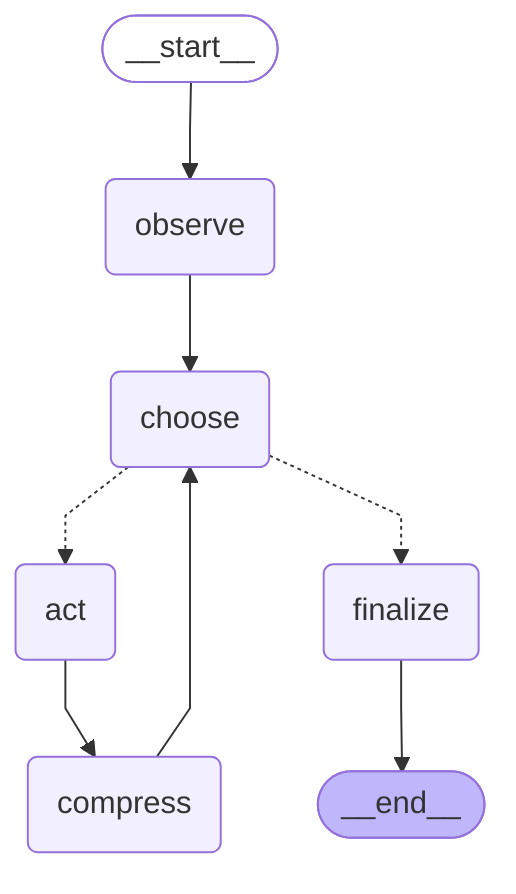

# Architecture

This is the long-form walkthrough. If you only have a minute, read
[`src/coding_agent/graph.py`](../src/coding_agent/graph.py) — the loop
fits on one screen.

## The big picture

Raschka's article frames a coding agent as three layers:

```
        Model (engine: a chat LLM)
            ↑    ↓
        Agent Loop (decide → act → observe → repeat)
            ↑    ↓
        Harness  (context management, tool exposure, state, sandbox)
```

The *harness* is everything that surrounds the model: the prompt builder,
the tool registry and sandbox, the transcript and working memory, the
compression policy. In this repo the harness is implemented as a
LangGraph state machine, and the model is the swappable interface.

## The graph

Generated from the compiled graph (`get_graph().draw_mermaid()`), so it
always matches [`graph.py`](../src/coding_agent/graph.py). Dotted arrows
are the conditional edge out of `choose`:

<!-- graph-diagram:start (generated by scripts/render_graph_diagram.py) -->

<!-- graph-diagram:end -->

Five nodes, three edges that matter (`observe → choose`, the conditional
out of `choose`, and `compress → choose`). Everything else is a straight
line.

## The state

`AgentState` is a `TypedDict` with no reducers. Every node that wants to
add transcript entries reads `state["transcript"]` and returns the full
new list. This is slightly more verbose than using `operator.add`, but it
means the `compress` node can replace the transcript wholesale without
fighting a reducer — important because compression's whole job is to
shrink the list.

The fields:

| Field | Purpose |
|-------|---------|
| `user_request`        | The free-text task the user gave the agent. |
| `workspace`           | `WorkspaceFacts` — collected once, lives in the stable prompt prefix. |
| `memory`              | `WorkingMemory` — distilled "what matters right now". |
| `transcript`          | Full list of `TranscriptEntry` — user / assistant / tool_call / tool_result / summary. |
| `pending_tool_calls`  | Tool calls queued by `choose`, drained by `act`. |
| `iterations`          | Loop guard. |
| `max_iterations`      | Hard limit; ends the run with a "stopped" answer. |
| `final_answer`        | Set by `choose` when the model returns text with no tool calls. |
| `error`               | Machine-readable stop reason; `"max_iterations"` when the loop guard fired. |

## The two-tier memory model

Raschka's most subtle point is that "transcript" and "working memory" are
*different things*:

* **Transcript** is the long, raw record of every event. It is what we
  compress when it grows too large, and what we'd persist to disk if we
  wanted to resume a session later.

* **Working memory** is a small, living summary of what matters right
  now — current plan, open questions, files touched. It survives
  transcript compression untouched.

In this code, working memory is intentionally minimal (just a list of
files touched, plus a scratchpad string). A production agent would have
the model write to working memory explicitly via a dedicated tool. The
hooks are all in place — see `state.py`.

## Component-by-component

### 1 · Live Repo Context — `context.py`

`collect_workspace_facts(root)` walks the workspace once and returns a
deterministic summary: a truncated directory listing plus a few "is there
a README / pyproject?" notes. Determinism is important: if two runs see
the same workspace they should produce the same string, otherwise prompt
caching is defeated.

### 2 · Prompt Shape and Cache Reuse — `prompts.py`

The prompt is always assembled in this order:

```
[ system message (stable prefix) ]   ← cacheable
[ replayed transcript            ]   ← dynamic
[ working-memory snapshot        ]   ← dynamic
[ current user request           ]   ← dynamic
```

The system message contains the policy + workspace tree, and never
changes mid-session. Providers that support prompt caching (OpenAI,
Anthropic, Gemini) will re-use it for free.

### 3 · Tool Access and Use — `tools.py`

Four sandboxed tools, all bound to `settings.workspace_root`:

* `list_dir(path)`
* `read_file(path)`
* `write_file(path, content)`
* `run_shell(cmd, timeout=30)`

Every path is forced inside the workspace via `_resolve_inside`. The
shell tool uses `shlex.split` and `subprocess.run(shell=False)` — *no*
shell expansion, so `echo $HOME` passes `$HOME` literally as an argv
element. This is a real security boundary, not a comment.

Tool calls flow through a `permission_gate` hook. The default gate
always approves; replace it to add interactive approval, allowlists, or
per-tool policies. The gate is per-call so future LangGraph
`interrupt_before` integration is a one-line change.

### 4 · Context Reduction — `compression.py`

Two layers:

1. **Per-tool clipping.** Every tool output is clipped to
   `settings.tool_output_limit` chars before going back into the
   transcript. Prevents one runaway `ls -R /` from blowing up the
   prompt.

2. **Transcript compression.** Once the transcript grows past
   `settings.transcript_compress_at` entries, the head is replaced with
   a single rule-based summary entry that names the tools used and the
   files referenced. The most-recent `KEEP_RECENT` entries are kept
   verbatim because they are the most relevant.

The summariser is deterministic (no LLM call) so tests are reproducible
and learners can read exactly what survives compression. Swapping in an
LLM-based summariser is one function call away.

### 5 · Structured Session Memory — `state.py`

See *the state* section above. The key idea is the two-tier split:
transcript for the durable record, working memory for task continuity.

### 6 · Delegation with Bounded Subagents — `subagents.py`

The parent gets one extra tool, `spawn_subagent(task)`. Calling it runs
the **same graph** again — `run_agent(..., depth=1)` — on the task, and
returns only the child's `final_answer` as the tool result. The dozens of
file reads the child made never enter the parent's transcript, which is
the whole point: delegation is a context-reduction strategy.

There is no second graph definition. `build_agent_graph` takes a `depth`
argument and that is the only switch between "parent" and "subagent":

```
depth 0 (parent)  : list_dir, read_file, write_file, run_shell, MCP tools…, spawn_subagent
depth 1 (subagent): list_dir, read_file
```

*Bounded* means each of these is enforced in code, with a test in
`tests/test_subagents.py`:

| Bound | Mechanism |
|-------|-----------|
| Read-only toolset | `subagent_toolset()` keeps an **allowlist** (`list_dir`, `read_file`). Anything else — `write_file`, `run_shell`, MCP tools, `spawn_subagent` — isn't bound to the child's model, and the child's `act` node rejects it as an unknown tool. |
| Depth limit 1 | `spawn_subagent` is only added when `depth < SUBAGENT_MAX_DEPTH` (= 1). |
| Own iteration cap | `subagent_settings()` derives the child's `Settings` with `max_iterations = CODING_AGENT_SUBAGENT_MAX_ITERATIONS` (default 4). |
| Per-run spawn cap | A counter in the tool's closure. After `CODING_AGENT_MAX_SUBAGENTS` (default 3) spawns the tool returns an `ERROR: …` string — never an exception — so the model can carry on. |
| Same sandbox | The child's `Settings` differ from the parent's *only* in `max_iterations`, so `workspace_root` is shared. |
| Clipped result | The answer is clipped to `tool_output_limit` before it returns. If the child ran out of iterations, it reports that plus its last tool result, still clipped. |

Each child has its own `TracingCallbackHandler` with
`run_label="subagent-N"`, so `traces/` holds one JSONL file for the parent
and one per child. The child runs inside a fresh `contextvars.Context`.
Without that, LangChain's inherited run config would also report every
child LLM call to the parent's tracer.

For the `fake` provider, parent and child take separate scripts:
`run_agent(..., fake_responses=[...], fake_subagent_responses=[...])`.
Every child replays its script from the start.

## Why no separate `inspect` node?

The article distinguishes "observe" (gather environment) from "inspect"
(look at memory/transcript). In code, inspection collapses into prompt
construction: building the prompt is the inspection. Splitting them
would add a node that does nothing but pass state through. The article's
*names* still live in the docstrings as landmarks.
